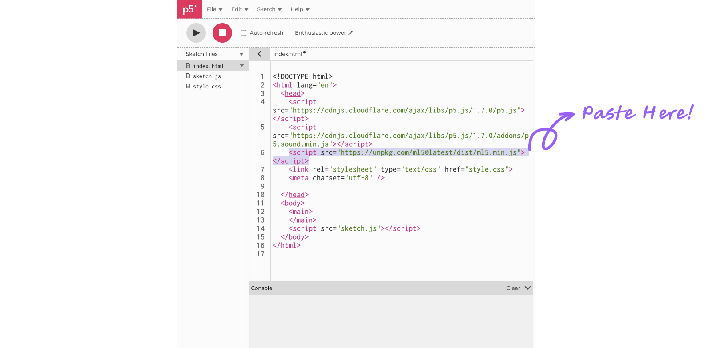

# Getting Started

<center>
  
  <p class="img-credit"> Image Credit: <a href="">Name</a> | <a href="">Contribute ♥️</a> </p>
</center>

This tutorial uses ml5.js to:

1. Load a pre-trained ml5.js image classification model
2. Load an image for the model to identify the object in the image
3. Get the results from the model and display them on the canvas

This tutorial is a p5.js sketch running on [p5.js web editor](https://editor.p5js.org/). To follow this tutorial, create an empty project on the p5.js web editor as instructed below.

1. Open the p5.js web editor.
2. Sign up or log in to your account. This is required because you will need to upload files to the project directory later on in the tutorial.

_ You can find the full code for this tutorial at [imageClassifier single image example code](https://editor.p5js.org/ml5/sketches/pjPr6XmPY). Press the run button to see the code in action._

## Set up ml5.js {docsify-ignore}

Unfold the project directory by clicking the arrow `>` at the top left corner of the p5.js editor.

<!-- TODO: photoshop image so that all have 800 px width before styling -->
<center>
    
</center>

In the `index.html` file, copy and paste the following CDN link inside the `<head>` tag.

```html
<script src="https://unpkg.com/ml5@latest/dist/ml5.min.js"></script>
```

<center>
    
</center>

To check if the ml5.js library has been imported successfully, switch back to `sketch.js`.

Include this line of code: `console.log('ml5 version:', ml5.version);` inside the `setup()` function.

```js
function setup() {
  createCanvas(400, 400);
  console.log("ml5 version:", ml5.version);
}

function draw() {
  background(220);
}
```

If everything loaded properly you should see the version number of the ml5 library show up in the console.

<center>
    
</center>

## Load pretrained ml5.js model {docsify-ignore}

In the `sketch.js` file, define a variable called `classifier` to hold the image classifier model.

```js
let classifier;
```

Add a `preload()` function to load the image classification model. In this example, we are using the MobileNet model.

```js
function preload() {
  classifier = ml5.imageClassifier("MobileNet");
}
```

_ If you are not familiar with terms like `pretrained model`, `classification`, `classifier`, `preload function`, `MobileNet` and would like to learn more about them, check out our [ml5 Glossary](/learning/ml5-glossary) for a quick intro._

## Load an image for the model to identify {docsify-ignore}

Unfold the project directory by clicking the arrow `>` at the top left corner of the p5.js editor.

<center>
    
</center>

Create a new folder called `images`.

<center>
    
</center>

And upload a bird image named `bird.png` to the `images` folder. Remember to login to see this option.

<center>
    
</center>

Open the `sketch.js` file and define a variable called `img` to hold the image you want to classify.

```js
let img;
```

Within the `preload()` function, load the image using the `loadImage()` function.

```js
function preload() {
  classifier = ml5.imageClassifier("MobileNet");
  img = loadImage("images/bird.png");
}
```

## Make predictions with the model {docsify-ignore}

In the `setup()` function, call the `classify()` function on the `classifier` object to classify the image. The `classify()` function takes two parameters: the image you want to classify and a callback function called `gotResult`.

```js
function setup() {
  createCanvas(400, 400);
  classifier.classify(img, gotResult);
}
```

The callback function `gotResult()` is a function that will be called when the `classify()` function finishes classifying the image. Now, let's define the `gotResult()` function.

```js
function gotResult(results) {
  console.log(results);
}
```

_If you are not familiar with the concept of `callback` and would like to learn more about it, check out our [ml5 Glossary](/learning/ml5-glossary) for more information._

## Display the results on the canvas {docsify-ignore}

As we discussed above, the `gotResult()` function will be called when the `classify()` function finishes classifying the image. And a variable `results` that contains the results of the classification will be passed along to `gotResult()`. Let's take a look at the `results` that is received by the `gotResult()` function.

```js
[
  {
    label: "robin, American robin, Turdus migratorius",
    confidence: 0.9026526212692261,
  },
  {
    label: "worm fence, snake fence, snake-rail fence, Virginia fence",
    confidence: 0.0029119430109858513,
  },
  {
    label: "brambling, Fringilla montifringilla",
    confidence: 0.0015617000171914697,
  },
];
```

The `results` is an array of objects ordered by confidence. The object at index 0 has the highest confidence. By default, ml5.js image classifier mobileNet model returns the top 3 labels with their confidence scores. In this example, we are interested in the top 1 result which has the highest confidence, which is the label has the highest probability of being correct.

Define two variables `label` and `confidence` to store the label and confidence of the top 1 result.

```js
let label = "";
let confidence = "";
```

In the `gotResult()` function, display the label and confidence of the top 1 result on the canvas using the `text()` function.

```js
function gotResult(results) {
  console.log(results);

  fill(255);
  stroke(0);
  textSize(18);
  label = "Label: " + results[0].label;
  confidence = "Confidence: " + nf(results[0].confidence, 0, 2);
  text(label, 10, 360);
  text(confidence, 10, 380);
}
```

Lastly, render the image to the canvas using the `image()` function.

```js
function setup() {
  createCanvas(400, 400);
  classifier.classify(img, gotResult);
  image(img, 0, 0);
}
```

_ If you are not familiar with terms like `label`, `confidence` and would like to learn more about them, check out our [ml5 Glossary](/learning/ml5-glossary) for a quick intro._

## Run Your Sketch {docsify-ignore}

Now, you may want to run your sketch and see if the model can make predictions and provide meaningful outputs. Press the run button on the top right corner of the interface. And you should see something like this.

<center>
    
</center>

## And voilà! {docsify-ignore}

You've just made a simple machine learning powered program that:

1. takes an image,
2. classifies the content of that image, and
3. displays the results all in your web browser!

Not all of our examples are structured exactly like this, but this provides a taste into how ml5.js is trying to make machine learning more approachable. Try using different images and seeing what kinds of things get returned.

<br/>

Some guiding questions you might start to think about are:

1. Do you notice that MobileNet is better at classifying some animals over others? Why do you think that is?
2. Does the top result always accurately describe the image?

## What Next? {docsify-ignore}

Now, you have already built up your first-ever ml5.js project. Interested in using ml5.js to build more ML-based projects and would like learn more? Check out our [Next Steps](/welcome/next-steps) page!

<br>
