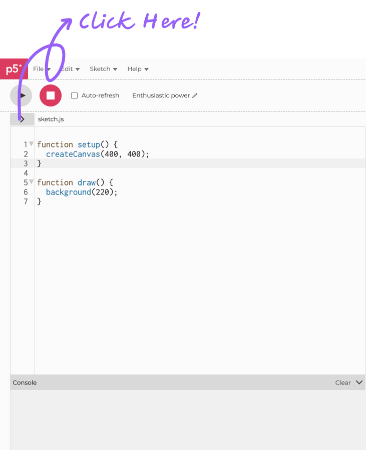
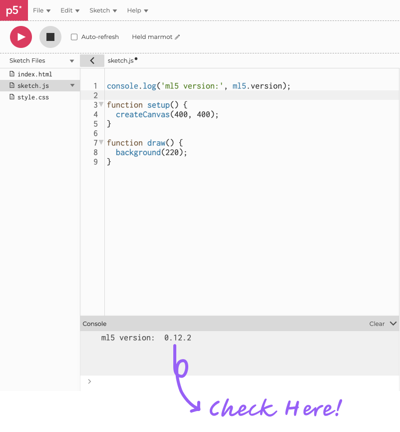
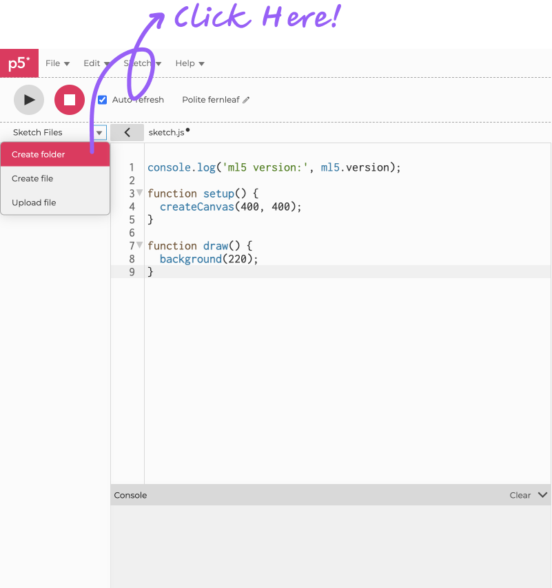
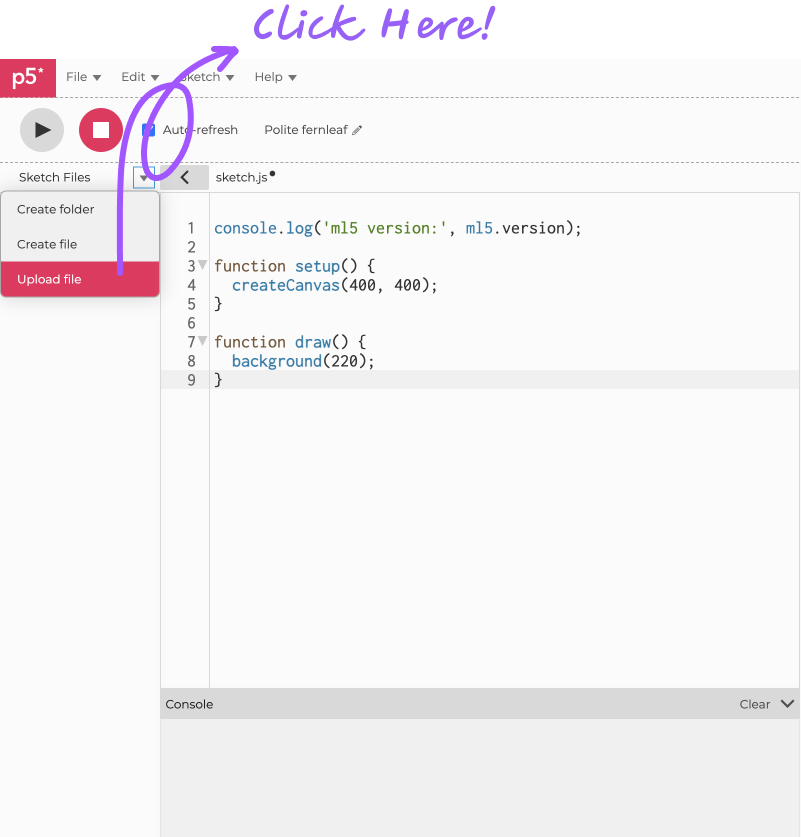

# Getting Started

Welcome to the ml5.js documentation. Here you'll find everything you need to get up and started with ml5.js.

## Create an Empty Project

First, we need to create an empty project to start with. Here, we introduces two ways to initialize your project:

### Try ml5.js Online

If you would like to get a taste of ml5.js in minutes, the easiest way is using the [p5.js editor](https://editor.p5js.org/). You can open the web editor and follow [the next step to import the ml5 library](/?id=try-ml5js-online-1).

_ If you are not familiar with p5.js, check out the [p5.js Get Started page](https://p5js.org/get-started/) to know more!_

### Try ml5.js Locally

If you want to start a project from scratch and develop it locally, make sure to have these tools ready:

> -  A text editor (e.g. [WebStorm](https://www.jetbrains.com/webstorm/), [Visual Studio Code](https://code.visualstudio.com/), [Sublime Text](https://www.sublimetext.com/))
> -  Your web browser: Chrome & Firefox preferred

Your project directory should look something like this:

```
|_ /my-first-ml5-project
  |_ index.html
  |_ sketch.js
```

**Where**:

- **my-first-ml5-project/**: is the root project folder
  - &ensp; **index.html**: is an .html file that has your html markup and library references
  - &ensp; **sketch.js**: is where you'll be writing your javascript

If you are done, follow [the next step to import the ml5 library](/?id=try-ml5js-locally-1).

## Import ml5.js Library

### Try ml5.js Online

Open the sidebar revealing the **Sketch Files** by clicking the arrow **'>'** at the top left corner of the p5.js editor.

<center>
    
</center>

In the **index.html** file, copy and paste the following CDN link inside the **&lt;head&gt;** tag.

```html
<script src="https://unpkg.com/ml5@latest/dist/ml5.min.js"></script>
```

<center>
    
</center>

To check if the ml5.js library has been imported successfully, switch back to **sketch.js**.

Include this line of code: `console.log('ml5 version:', ml5.version);` inside the **setup()** function.

```js
function setup() {
  createCanvas(400, 400);
  console.log("ml5 version:", ml5.version);
}

function draw() {
  background(220);
}
```

If everything loaded properly you should see the version number of the ml5 library show up in the console.

<center>
    
</center>

Follow [the next step to prepare your image assets](/?id=try-ml5js-online-2)!

### Try ml5.js Locally

Open your **index.html** file.

Here you can see that we reference the needed JavaScript libraries, so that they get loaded by the browser as the page loads. This includes our ml5.js version as well as p5.js. You can copy and paste this into your **index.html** file or for good practice you can type it all out. Make sure to save the file and refresh your browser after saving.

```html
<html>
  <head>
    <meta charset="UTF-8" />
    <title>Image classification using MobileNet and p5.js</title>

    <script src="https://cdnjs.cloudflare.com/ajax/libs/p5.js/1.0.0/p5.min.js"></script>
    <script src="https://unpkg.com/ml5@latest/dist/ml5.min.js"></script>
  </head>

  <body>
    <h1>Image classification using MobileNet and p5.js</h1>
    <script src="sketch.js"></script>
  </body>
</html>
```

Follow [the next step to prepare your image assets](/?id=try-ml5js-locally-2)!

## Prepare Image Assets For Your First Sketch {docsify-ignore}

If you've arrived here, we assume you've imported ml5.js library to your project. Now, let's prepare the image assets we will be using soon.

### Try ml5.js Online

Open the sidebar revealing the **Sketch Files** by clicking the arrow **'>'** at the top left corner of the p5.js editor.

<center>
    
</center>

Create a new folder called `images`.

<center>
    
</center>

And upload a bird image named `bird.png` to the `images` folder. Remember to login to see this option.

<center>
    
</center>

Now, we are ready to write our first ml5.js sketch! Follow [the next step to write your first sketch](/?id=your-first-sketch)!

### Try ml5.js Locally

Create a new folder called `/images` under your root folder, and add a bird image named `bird.png` to the `/images`.

Your project directory should look something like this:

```
|_ /my-first-ml5-project
  |_ /images
    |_ bird.png
  |_ index.html
  |_ sketch.js
```

**Where**:

- **my-first-ml5-project/**: is the root project folder
  - &ensp; **images/**: is a folder that contains your image
    - &ensp; &ensp; &ensp;  **bird.png**: is a .png image of a bird (it can also be something else!)
  - &ensp; **index.html**: is an .html file that has your html markup and library references
  - &ensp; **sketch.js**: is where you'll be writing your javascript

Now, we are ready to write our first ml5.js sketch! Follow [the next step to write your first sketch](/?id=your-first-sketch)!

## Your First Sketch

Now, no matter you are trying ml5.js online or locally, open your **sketch.js**.

We can start to build your first ml5.js sketch - a classic application of machine learning: **image classification**. This application showcases how you can use a [pre-trained](https://youtu.be/yNkAuWz5lnY?si=0JuaPFYlxLFE0WSU) model called [MobileNet](https://github.com/tensorflow/tfjs-models/tree/master/mobilenet) -- a machine learning model trained to recognize the content of certain images -- in ml5.js. The application aims to highlight a general pattern for how ml5.js projects are setup.

Inside your **sketch.js** file you can type out (or copy and paste) the following code. Notice in this example we have a reference to "images/bird.png". You'll replace this with the name of your image.

```js
let classifier;

// A variable to hold the image we want to classify
let img;

// Variables for displaying the results on the canvas
let label = "";
let confidence = "";

function preload() {
  // Initialize the Image Classifier method with MobileNet
  classifier = ml5.imageClassifier("MobileNet");
  img = loadImage("images/bird.jpg");
}

function setup() {
  createCanvas(400, 400);
  classifier.classify(img, gotResult);
  image(img, 0, 0, width, height);
}

// A function to run when we get the results
function gotResult(results) {
  // The results are in an array ordered by confidence, print in console
  console.log(results);

  // Display the results on the canvas
  fill(255);
  stroke(0);
  textSize(18);
  label = "Label: " + results[0].label;
  confidence = "Confidence: " + nf(results[0].confidence, 0, 2);
  text(label, 10, 360);
  text(confidence, 10, 380);
}
```

_ If you are not familiar with terms like **pre-trained model**, **MobileNet**, **classification**, **classifier**, **confidence** and would like to learn more about them, check out our [ml5 Glossary](/learning/ml5-glossary) for a quick intro._

## Our sketch.js explained in 4 steps {docsify-ignore}

### Step 1: Define your variables

Here we define our variables that we will assign our classifier, image, label, and confidence to.

```js
let classifier;

// A variable to hold the image we want to classify
let img;

// Variables for displaying the results on the canvas
let label = "";
let confidence = "";
```

### Step 2: Load your imageClassifier and image

Use p5's **preload()** function to load our imageClassifier model and our bird image before running the rest of our code. Since machine learning models can be large, it can take time to load. We use **preload()** in this case to make sure our imageClassifier and image are ready to go before we can apply the image classification in the next step.

```js
function preload() {
  classifier = ml5.imageClassifier("MobileNet");
  img = loadImage("images/bird.png");
}
```

_ If you are not familiar with term **preload function**, check out our [ml5 Glossary](/learning/ml5-glossary) for more information._

### Step 3: Setup, classify, and display

In p5.js we use the **setup()** function for everything in our program that just runs once. In our program, we use the **setup()** function to:

1. create a canvas to render our image
2. call .classify() on our classifier to classify our image
3. render the image to the canvas

You will notice that the **.classify()** function takes two parameters: 1. the image you want to classify, and 2. a callback function called **gotResult**. Let's next look at what **gotResult** does.

```js
function setup() {
  createCanvas(400, 400);
  classifier.classify(img, gotResult);
  image(img, 0, 0);
}
```

### Step 4: Define the gotResult() callback function

The **gotResult()** function takes one parameter: the result. This parameter gets passed along to **gotResult()** when the **.classify()** function finishes classifying the image. If our classifier manages to recognize the content of the image, then a **result** will be returned.

<br/>

In the case of our program, we are interested in the top 1 result which has the highest confidence and stored in **results[0]**. We store the label and confidence of the result in the variables **label** and **confidence** respectively, and then display the label and confidence of the result on the canvas with the **text()** function. The **[nf()](https://p5js.org/reference/#/p5/nf)** function is a p5 function that formats our number to a nicer string.

```js
// A function to run when we get the results
function gotResult(results) {
  // The results are in an array ordered by confidence, print in console
  console.log(results);

  // Display the results on the canvas
  fill(255);
  stroke(0);
  textSize(18);
  label = "Label: " + results[0].label;
  confidence = "Confidence: " + nf(results[0].confidence, 0, 2);
  text(label, 10, 360);
  text(confidence, 10, 380);
}
```

_ If you are not familiar with terms like **callback**, **label**, **confidence**, check out our [ml5 Glossary](/learning/ml5-glossary) for more information._

## Need Help On Your Code? {docsify-ignore}

Check our examples below for reference:

1. If you try ml5.js online with p5 web editor, check [ml5.js image classification on p5 web editor](https://editor.p5js.org/ml5/sketches/ImageClassification)
2. If you try ml5.js locally, check [ml5.js image classification on Github](https://github.com/ml5js/ml5-next-gen/tree/main/examples/ImageClassifier)

## Run Your Sketch {docsify-ignore}

Now, you may want to run your sketch and see if the model can make predictions and provide meaningful outputs.

### Try ml5.js Online

Simply press the **Play** button on the top right corner of the interface. And you should see something like this.

<center>
    
</center>

### Try ml5.js Locally

To run the sketch locally, we need to start a local development server.

_ If you are not familiar with term **local development server**, check out our [ml5 Glossary](/learning/ml5-glossary) for more information._

#### Step 1. Open your terminal

```sh
# change directories to your project root directory
cd my-first-ml5-project

# start a local web server
python3 -m http.server
```

_ If you are not familiar with terms like **terminal**, **dependencies**, check out our [ml5 Glossary](/learning/ml5-glossary) for more information._

#### Step 2. In a browser, open the following URL:

```
http://localhost:8000/
```

This should make your sketch show up.

_ You may also be interested in watching [CodingTrain - getting set up](https://www.youtube.com/watch?v=UCHzlUiDD10) for a nice intro on getting set up with writing code for the web._

## And voilà! {docsify-ignore}

You've just made a simple machine learning powered program that:

1. takes an image,
2. classifies the content of that image, and
3. displays the results all in your web browser!

Not all of our examples are structured exactly like this, but this provides a taste into how ml5.js is trying to make machine learning more approachable. Try using different images and seeing what kinds of things get returned.

<br/>

_ Some guiding questions you might start to think about are:_

_1. When classifying an image with MobileNet, does the computer see people? If not, why do you think that is?_
_2. Do you notice that MobileNet is better at classifying some animals over others? Why do you think that is?_

## What Next?

Now, you have already built up your first-ever ml5.js project. Interested in using ml5.js to build more ML-based projects and would like learn more? Check out our [Next Steps](https://ml5js.github.io/ml5-website-v02-docsify/#/welcome/next-steps) page!

<br>
