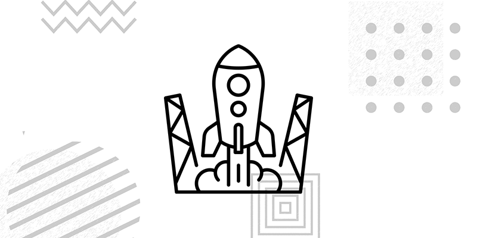
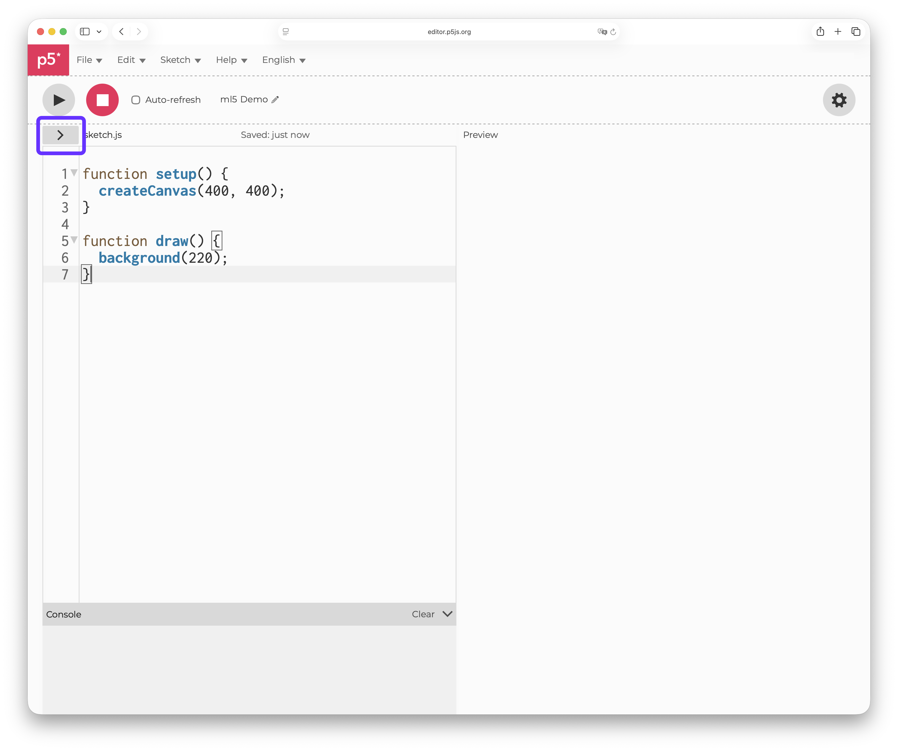
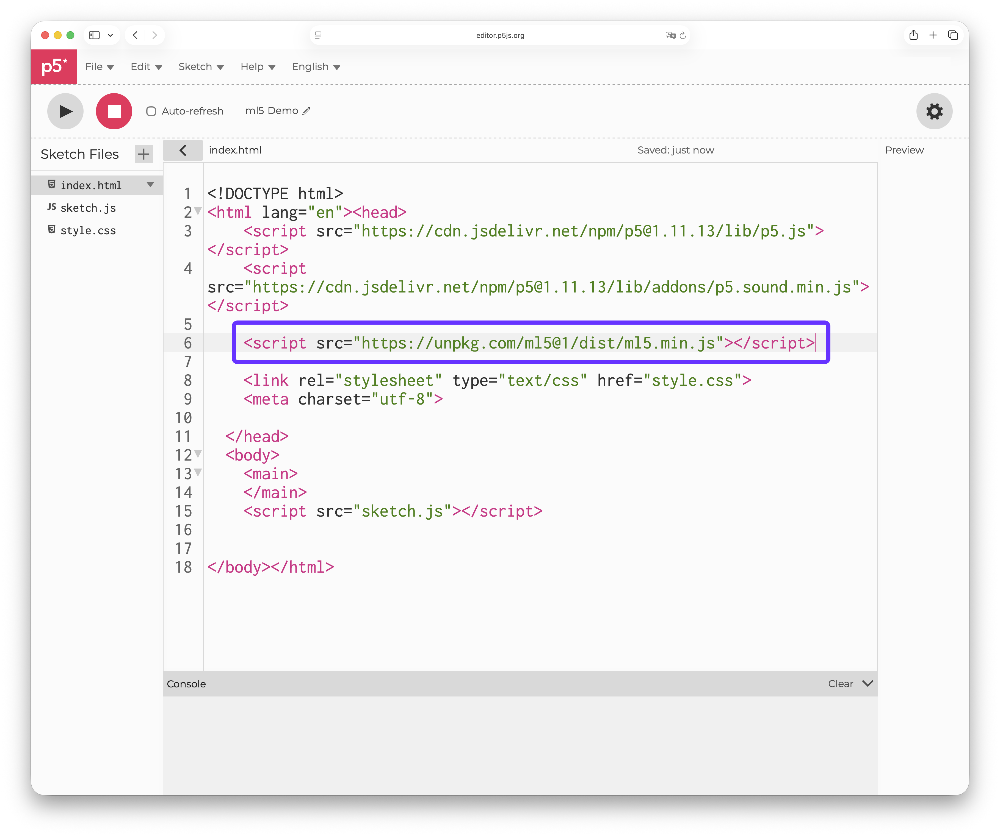
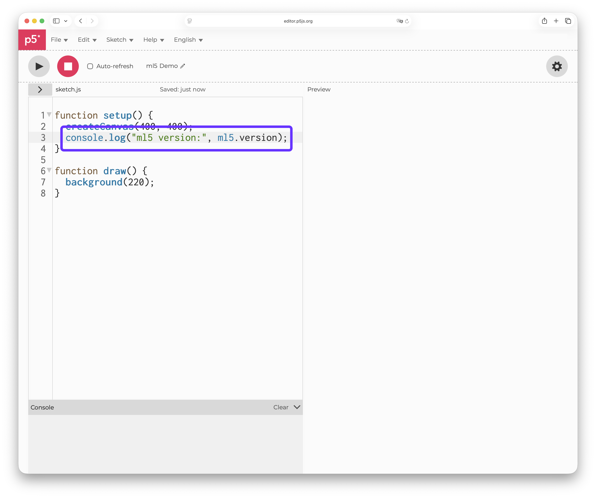
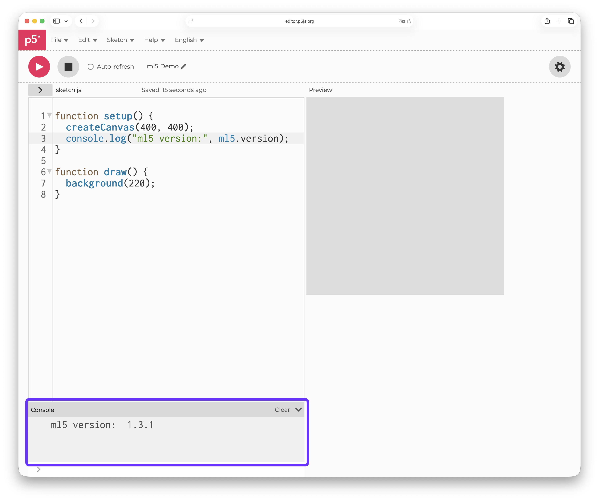
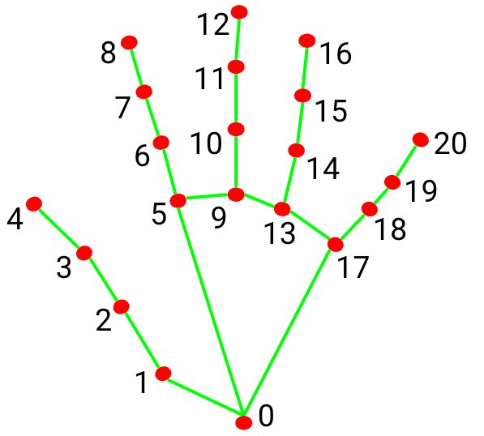

# Getting Started

<center>
  
  <p class="img-credit"> Image Credit: <a href="https://thenounproject.com/creator/ifkirianto.if" target="_blank" title="Iki">Iki</a> | <a href='https://forms.gle/5EpwYabG8hLn4p926' target="contribute-form">Contribute ♥️</a> </p>
</center>

Welcome! We're going to walk through how to start using ml5.js by creating a simple hand tracking program.

This page will cover how to:

1. Import the ml5.js library into your p5.js sketch
2. Access the webcam to detect hands in real-time
3. Load the HandPose model
4. Get the detection results from the model
5. Draw circles on the hand's index finger tip and thumb on the canvas

We will be using a p5.js sketch running on the [p5.js web editor](https://editor.p5js.org/). To get started, open up the p5.js web editor and create an empty project. Be sure to sign up or log in to your account!

<!-- ?> You can find the full code for this tutorial at the [HandPose example code](https://editor.p5js.org/ml5/sketches/QGH3dwJ1A). Feel free to open it up in the p5.js web editor and run it to see how it works. -->

## Import ml5.js {docsify-ignore}

Once you have the p5.js web editor open, unfold the project directory by clicking the arrow `>` at the top left corner.

<center>
    
</center>

Now, let's switch to the `index.html` file and copy and paste the following CDN link inside the `<head>`, `</head>` tags.

```html
<script src="https://unpkg.com/ml5@1/dist/ml5.min.js"></script>
```

<center>
    
</center>

We can check if the ml5.js library has been imported successfully by using the `console.log()` method. Use the side bar (project directory) to switch back to the `sketch.js` file and include this line of code inside the `setup()` function.

```javascript
console.log("ml5 version:", ml5.version);
```

<center>
    
</center>

Then, press the run `>` button on the top left corner of the editor to run the sketch.

If everything loaded properly, you should see the version number of the ml5.js library show up in the console.

<center>
    
</center>


## Set up the webcam video {docsify-ignore}

In the `sketch.js` file, we will define a variable called `video` to hold the webcam capture.

```javascript
let video;
```

Inside the `setup()` function, add `createCapture(VIDEO)` to access the webcam, and hide the HTML video element so we can draw it directly onto our canvas later. We set the canvas and video size to `640` x `480` pixels, as it's a common webcam resolution that works well for most computers.

```javascript
function setup() {
  // Change the canvas size to a common webcam resolution
  createCanvas(640, 480);
  console.log("ml5 version:", ml5.version);
  // Access the webcam
  video = createCapture(VIDEO); 
  // Resize the webcam video to match the canvas size
  video.size(640, 480); 
  // Hide the HTML video element
  video.hide();
}
```

## Load the HandPose model {docsify-ignore}

In the `sketch.js` file, we will define a variable called `handPose` to hold the HandPose model.

```javascript
let handPose;
```

To load the model in **p5.js 2.x**, we will use the `async`/`await` pattern. First, we need to make our `setup()` function asynchronous by adding the `async` keyword before it. Then, we can use `await ml5.handPose()` to make sure the model is fully loaded before our sketch proceeds.

```javascript
async function setup() {
  handPose = await ml5.handPose();
}
```
?> In p5.js 1.x, you would use the `preload()` function to load the model.

Let's apply this to the code we have so far.

```javascript
let video;
// Define a variable "handPose" to store the HandPose model.
let handPose;

async function setup() {
  createCanvas(640, 480);

  video = createCapture(VIDEO);
  video.size(640, 480);
  video.hide();
  // Load the HandPose model.
  handPose = await ml5.handPose();
}
```

## Detect hand keypoints with the model {docsify-ignore}

Now that the model is loaded, we can tell it to start detecting hands! We'll use the `detectStart()` function, which takes **two parameters**: the **webcam video** as our **input**, and a callback function called `gotHands` to handle the model's **output** (the detection results, **hands**).

```javascript
handPose.detectStart(video, gotHands);
```


Next, let's define a variable `hands` and a callback function `gotHands()`. The callback function `gotHands()` will continuously receive the detection results from the model and store them in our `hands` array.

```javascript
let hands = [];

function gotHands(results) {
  hands = results;
}
```

?> If you are not familiar with the concept of `callback` and would like to learn more about it, check out our [ml5 Glossary](/learn/ml5-glossary) for more information.

Let's put it all together and see what we have so far.

```javascript
let video;
let handPose;
// Define a variable "hands" to store the detection results.
let hands = [];

async function setup() {
  createCanvas(640, 480);

  video = createCapture(VIDEO);
  video.size(640, 480);
  video.hide();

  handPose = await ml5.handPose();
  // Start detecting hands in the webcam video
  handPose.detectStart(video, gotHands);
}

// Callback function to receive the detection results
function gotHands(results) {
  // Store the detection results in the hands array
  hands = results;
}
```

## Display the results on the canvas {docsify-ignore}
When a hand is detected, the `hands` array receives detailed data from the model. This includes the coordinates for 21 different finger joints and fingertips!

Take a look at the diagram below, showing all 21 points with their names!

<div style="display: flex; gap: 40px; align-items: flex-start;">
  <div style="min-width: 200px;">
    
  </div>
  <div style="min-width: 180px;">
    <ul style="list-style-type: none; padding-left: 0; margin: 0;">
      <li>[0] wrist</li>
      <li>[1] thumb_cmc</li>
      <li>[2] thumb_mcp</li>
      <li>[3] thumb_ip</li>
      <li>[4] thumb_tip</li>
      <li>[5] index_finger_mcp</li>
      <li>[6] index_finger_pip</li>
      <li>[7] index_finger_dip</li>
      <li>[8] index_finger_tip</li>
      <li>[9] middle_finger_mcp</li>
      <li>[10] middle_finger_pip</li>
    </ul>
  </div>
  <div style="min-width: 180px;">
    <ul style="list-style-type: none; padding-left: 0; margin: 0;">
      <li>[11] middle_finger_dip</li>
      <li>[12] middle_finger_tip</li>
      <li>[13] ring_finger_mcp</li>
      <li>[14] ring_finger_pip</li>
      <li>[15] ring_finger_dip</li>
      <li>[16] ring_finger_tip</li>
      <li>[17] pinky_mcp</li>
      <li>[18] pinky_pip</li>
      <li>[19] pinky_dip</li>
      <li>[20] pinky_tip</li>
    </ul>
  </div>
</div>
<br>

Instead of drawing every single joint, let's only track the tip of your index finger. We can access this specific point using `index_finger_tip`. *Let's keep it simple for this first ml5.js project!* 😎

We will draw the video first in the `draw()` function.

```javascript
function draw() {
  background(220);
  // Draw the webcam video on the canvas
  image(video, 0, 0);
}
```

Then, we will check if a hand is detected by checking if the `hands` array has at least one element. If so, we will get the `x` and `y` coordinates of the index finger tip, and draw a circle on the canvas at the position.

```javascript
// Check if there is at least one hand detected
if (hands.length > 0) {
 // Get the index finger tip and thumb of the first hand (index: 0 in the array)
 let fingerX = hands[0].index_finger_tip.x;
 let fingerY = hands[0].index_finger_tip.y;

 // Draw a yellow circle on the index finger tip
 noStroke();
 fill(255, 255, 0);
 circle(fingerX, fingerY, 20);
}
```

Let's also try to get the thumb coordinates and draw a red circle on it!

```javascript
if (hands.length > 0) {
 let fingerX = hands[0].index_finger_tip.x;
 let fingerY = hands[0].index_finger_tip.y;
 // Get the thumb tip coordinates
 let thumbX = hands[0].thumb_tip.x;
 let thumbY = hands[0].thumb_tip.y;

 noStroke();
 fill(255, 255, 0);
 circle(fingerX, fingerY, 20);
 // Draw a red circle on the thumb
 fill(255, 0, 0);
 circle(thumbX, thumbY, 20);  
}
```

<br>

!> Here is the complete code for your first ml5.js hand tracking sketch!

```javascript
let video;
let handPose;
let hands = [];

async function setup() {
  createCanvas(640, 480);

  video = createCapture(VIDEO);
  video.size(640, 480);
  video.hide();

  handPose = await ml5.handPose();
  handPose.detectStart(video, gotHands);
}

function draw() {
  background(220);
  image(video, 0, 0);

  if (hands.length > 0) {
    let fingerX = hands[0].index_finger_tip.x;
    let fingerY = hands[0].index_finger_tip.y;
    let thumbX = hands[0].thumb_tip.x;
    let thumbY = hands[0].thumb_tip.y;

    noStroke();
    fill(255, 255, 0);
    circle(fingerX, fingerY, 20);
    fill(255, 0, 0);
    circle(thumbX, thumbY, 20);
  }
}

function gotHands(results) {
  hands = results;
}
```

## Run your sketch!  {docsify-ignore}
Now, you are ready to see the results! Press the run button on the top left corner of the editor.

Move your hand in front of the webcam, and you should see a yellow circle and red circle following your index finger and thumb! 🎉

<!-- an image -->

## Voilà! 🎉 {docsify-ignore}

Congratulations on building your first hand tracking sketch!

Now that you know how to track the `index_finger_tip`, what else can you do?

- How about **drawing a line** that follows your index finger tip?
- How about creating a **pinch** gesture?

## What next? {docsify-ignore}

Now that you've built your first ml5.js project, take a look at other models and explore how you might use ml5.js for ML-based projects! Check out the [Next Steps](/welcome/next-steps) page to learn more.

<br>
