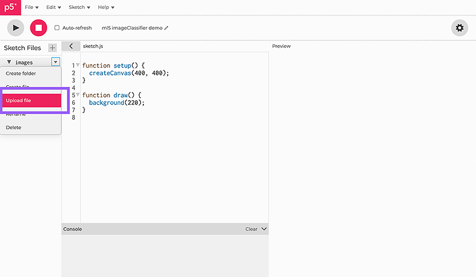

# Getting Started

<center>
  
  <p class="img-credit"> Image Credit: <a href="">Name</a> | <a href="">Contribute ♥️</a> </p>
</center>

Welcome! We're going to walk through how to start using ml5.js by creating a simple image classification program.

This page will cover how to:

1. Load a pre-trained ml5.js image classification model
2. Load an image for the model to identify the object in the image
3. Get the results from the model and display them on the canvas

We will using a p5.js sketch running on the [p5.js web editor](https://editor.p5js.org/). To get started, open up the p5.js web editor and create an empty project. Be sure to sign up or log in to your account so that you are able to upload files! This will be necessary later on as we upload images.

?> You can find the full code for this tutorial at [imageClassifier single image example code](https://editor.p5js.org/ml5/sketches/pjPr6XmPY). Press the run button to see the code in action.

## Set up ml5.js {docsify-ignore}

Once you have the p5.js web editor open, unfold the project directory by clicking the arrow `>` at the top left corner.

<!-- TODO: photoshop image so that all have 800 px width before styling -->
<center>
    
</center>

Now, let's switch to the `index.html` file and copy and paste the following CDN link inside the `<head>` tag.

```html
<script src="https://unpkg.com/ml5@alpha/dist/ml5.min.js"></script>
```

<center>
    
</center>

## Load pretrained ml5.js model {docsify-ignore}

Use the project directory to switch back to the `sketch.js` file. We will define a variable called `classifier` to hold the image classifier model.

```js
let classifier;
```

Next, add a `preload()` function to load the image classification model. In this example, we are using the MobileNet model.

```js
function preload() {
  classifier = ml5.imageClassifier("MobileNet");
}
```

?> If you are not familiar with terms like `pretrained model`, `classification`, `classifier`, `preload function`, or `MobileNet` and would like to learn more about them, check out our [ml5 Glossary](/learn/ml5-glossary) for a quick intro.

## Load an image for the model to identify {docsify-ignore}

Let's unfold the project directory again by clicking the arrow `>` at the top left corner of the p5.js editor.

<center>
    
</center>

Select the `+` to create a new folder called `images`.

<center>
    
</center>

To upload files to the folder, choose the `images` folder in the project directory and upload an image using the drop-down menu. For this example, we are uploading an image of a bird called `bird.png`. Make sure you are logged in to see this option.

<center>
    
</center>

Once the image is uploaded, go back to the `sketch.js` file and define a variable called `img` to hold the image you want to classify.

```js
let img;
```

Within the `preload()` function, load the image using the `loadImage()` function.

```js
function preload() {
  classifier = ml5.imageClassifier("MobileNet");
  img = loadImage("images/bird.png");
}
```

## Make predictions with the model {docsify-ignore}

In the `setup()` function, we will call the `classify()` function on the `classifier` object to classify the image. The `classify()` function takes two parameters: the image you want to classify and a callback function called `gotResult`.

```js
function setup() {
  createCanvas(400, 400);
  classifier.classify(img, gotResult);
}
```

Now, let's define the `gotResult()` function. The callback function `gotResult()` is a function that will be called when the `classify()` function finishes classifying the image.

```js
function gotResult(results) {
  console.log(results);
}
```

?> If you are not familiar with the concept of `callback` and would like to learn more about it, check out our [ml5 Glossary](/learn/ml5-glossary) for more information.

## Display the results on the canvas {docsify-ignore}

As we discussed above, the `gotResult()` function will be called when the `classify()` function finishes classifying the image. A variable `results` that contains the results of the classification will be passed along to `gotResult()`. Let's take a look at the `results` that is received by the `gotResult()` function.

```js
[
  {
    label: "robin, American robin, Turdus migratorius",
    confidence: 0.9026526212692261,
  },
  {
    label: "worm fence, snake fence, snake-rail fence, Virginia fence",
    confidence: 0.0029119430109858513,
  },
  {
    label: "brambling, Fringilla montifringilla",
    confidence: 0.0015617000171914697,
  },
];
```

The `results` is an array of objects ordered by confidence. The object at index 0 has the highest confidence. By default, ml5.js image classifier MobileNet model returns the top 3 labels with their confidence scores. In this example, we are interested in only the top result that has the highest confidence, which is the label that has the highest probability of being correct.

To get this, we are going to define two variables `label` and `confidence` to store the label and confidence of the top 1 result.

```js
let label = "";
let confidence = "";
```

In the `gotResult()` function, let's display the label and confidence of the top 1 result on the canvas using the `text()` function.

```js
function gotResult(results) {
  console.log(results);

  fill(255);
  stroke(0);
  textSize(18);
  label = "Label: " + results[0].label;
  confidence = "Confidence: " + nf(results[0].confidence, 0, 2);
  text(label, 10, 360);
  text(confidence, 10, 380);
}
```

Lastly, render the image to the canvas using the `image()` function.

```js
function setup() {
  createCanvas(400, 400);
  classifier.classify(img, gotResult);
  image(img, 0, 0);
}
```

?> If you are not familiar with terms like `label`, `confidence` and would like to learn more about them, check out our [ml5 Glossary](/learn/ml5-glossary) for a quick intro.

## Run your sketch {docsify-ignore}

Now, you are ready to see the results! Run your sketch and see if the model can make predictions and provide meaningful outputs. Press the run button on the top left corner of the editor.

You should get something like this:

<center>
    
</center>

## And voilà! {docsify-ignore}

You've just made a simple machine learning powered program that:

1. takes an image,
2. classifies the content of that image,
3. and displays the results all in your web browser!

Not all of our examples are structured exactly like this, but this provides a taste into how ml5.js is trying to make machine learning more approachable. You can try using different images and seeing what kinds of things get returned.

<br/>

Some guiding questions you might start to think about are:

1. Do you notice that MobileNet is better at classifying some animals over others? Why do you think that is?
2. Does the top result always accurately describe the image?

## What next? {docsify-ignore}

Now that you've built your first ml5.js project, take a look at other models and explore how you might use ml5.js for ML-based projects! Check out the [Next Steps](/welcome/next-steps) page to learn more.

<br>
